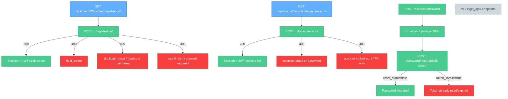
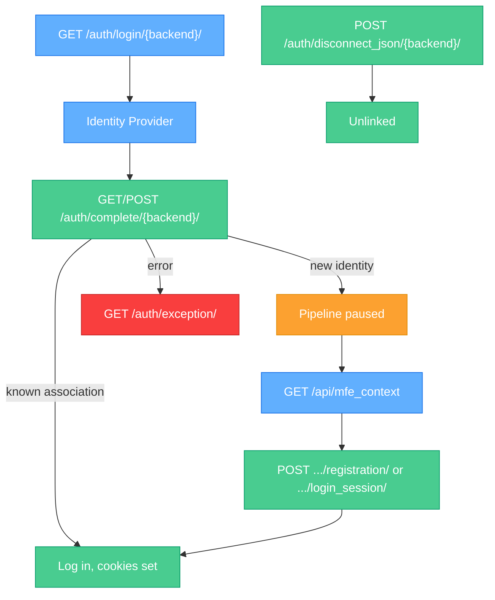
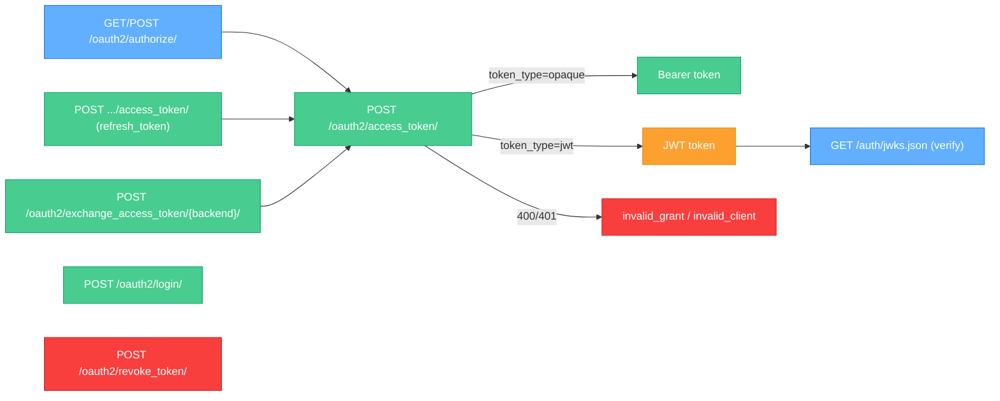

# edX Platform Authentication APIs — SDD

**Owner:** edX Authentication Team
**Status:** Accepted
**Last updated:** 2026-09-16

> This document is written to be pasted directly into Confluence (headings, tables, and code blocks all convert cleanly). It consolidates the three authentication domains owned by the auth team — **Core Registration & Login**, **Third-Party Authentication (TPA)**, and the **edX OAuth2 Bridge** — into a single reference with full request/response/error detail for every endpoint.
>
> Machine-readable source of truth: `docs/openapi/{authn,third-party-auth,oauth2}-openapi.yaml`. Narrative ADR-style specs: `docs/specs/{registration-login,third-party-auth,oauth2-bridge}/spec.rst`. This document is the human-readable, presentation-ready rollup of both.

**Contents**

1. [Overview](#1-overview)
   - [1.3 Visual API Map (color-coded, Swagger-style)](#13-visual-api-map-color-coded-swagger-style)
2. [Core Registration & Login](#2-core-registration--login-authn-openapiyaml)
3. [Third-Party Authentication — TPA Pipeline](#3-third-party-authentication--tpa-pipeline-third-party-auth-openapiyaml)
4. [edX OAuth2 Bridge](#4-edx-oauth2-bridge-oauth2-openapiyaml)
5. [API Schema Reference](#5-api-schema-reference)
6. [Security requirements (cross-cutting)](#6-security-requirements-cross-cutting)
7. [Deprecation & versioning notes](#7-deprecation--versioning-notes)
8. [Integration Guide — How to Use These APIs](#8-integration-guide--how-to-use-these-apis)
9. [References](#9-references)

---

## 1. Overview

| Domain | Owning module | Purpose |
|---|---|---|
| Core Registration & Login | `openedx/core/djangoapps/user_authn/` | Account creation, session login/logout, password reset, account activation |
| Third-Party Authentication | `common/djangoapps/third_party_auth/` | SAML / OAuth2 / LTI federated login, account linking |
| edX OAuth2 Bridge | `openedx/core/djangoapps/oauth_dispatch/`, `openedx/core/djangoapps/auth_exchange/` | RFC 6749 authorization server; issues opaque or JWT access tokens for calling edX REST APIs |

**High-level flow:**

```
Anonymous browser / SPA
        │
        ├── Core login/registration ───────────────► session + JWT cookies
        │        (Section 2)
        │
        ├── Federated login (TPA) ─────────────────► resolves to core login/registration
        │        (Section 3)                          or pauses pipeline for signup
        │
        └── OAuth2 bridge ─────────────────────────► access_token (opaque or JWT)
                 (Section 4)                          used to call edX REST APIs
```

### 1.1 Authentication schemes used throughout

| Scheme | How it's sent | Used for |
|---|---|---|
| **Session auth** | `sessionid` cookie | Browser-based endpoints; established by login |
| **CSRF token** | `X-CSRFToken` header (must match `csrftoken` cookie) | Every unsafe (POST/PUT/PATCH/DELETE) session-authenticated request |
| **JWT bearer** | `Authorization: JWT <token>` | Server-to-server / SPA calls using a JWT access token |
| **Opaque bearer** | `Authorization: Bearer <token>` | Server-to-server calls using a DOT opaque access token |
| **OAuth2 client credentials** | `client_id` + `client_secret` at the token endpoint | Trusted backend services with no end user |

### 1.2 Common error response shapes

Most `4xx` JSON responses use one of these shapes:

**Field-level validation error** (registration, generic form endpoints):
```json
{
  "error_code": "duplicate-email",
  "email": [
    { "user_message": "It looks like this email is already associated with an existing account." }
  ],
  "username_suggestions": ["janedoe2", "janedoe_edx"]
}
```

**Login error:**
```json
{
  "success": false,
  "value": "Email or password is incorrect.",
  "error_code": "incorrect-email-or-password",
  "email": "jane@example.com"
}
```

**OAuth2 error (RFC 6749 §5.2):**
```json
{
  "error": "invalid_grant",
  "error_description": "The provided authorization grant is invalid, expired, or revoked."
}
```

### 1.3 Visual API Map (color-coded, Swagger-style)

**Legend**

| Badge | Meaning |
|---|---|
|  | Read-only lookup — safe to call repeatedly, no state change |
|  | Creates / mutates state (account, session, token) |
|  | Removes state (e.g. unlinks a provider association) |
| 🟠 Orange node | Intermediate / pending state (JWT issued, pipeline paused) |
| 🔴 Red node | Terminal error outcome |
| ⚪ Gray dashed node | Deprecated — do not use for new integrations |

**Registration, login & password reset**



**Third-party auth (TPA) pipeline**



**edX OAuth2 bridge**



> These are [Mermaid](https://mermaid.js.org/) diagrams — they render as colored flowcharts natively in GitHub, VS Code preview, and Confluence (with the Mermaid macro/plugin installed). If your Confluence instance can't render Mermaid, use the "Insert → Mermaid Diagram" macro (or the draw.io mermaid import) and paste the code block contents.

---

## 2. Core Registration & Login (`authn-openapi.yaml`)

### 2.1 Endpoint index

| Method | Path | Summary |
|---|---|---|
|   | `/api/user/v2/account/registration/` | Registration form description / create account (current) |
|   | `/api/user/v1/account/registration/` | Deprecated alias (requires `confirm_email`) |
|  | `/api/user/v1/validation/registration` | Inline field validation, no account created |
|   | `/api/user/v2/account/login_session/` | Login form description / authenticate (current) |
|   | `/api/user/v1/account/login_session/` | Deprecated alias (`email` instead of `email_or_username`) |
|  | `/login_ajax` | Legacy AJAX login |
|  | `/login_refresh` | Re-issue JWT cookies for an existing session |
|  | `/account/finish_auth` | Post-login landing page (deferred actions e.g. auto-enroll) |
|   | `/logout` | Terminate session, fan out IDA logout |
|  | `/api/user/v1/account/password_reset/` | Forgot-password form description |
|  | `/account/password` | Request password-reset email |
|   | `/password_reset_confirm/{uidb36}-{token}/` | Django-style reset confirmation |
|  | `/api/user/v1/account/password_reset/token/validate/` | Validate a reset token |
|  | `/password/reset/{uidb36}-{token}/` | JSON reset confirmation (MFE + account recovery) |
|  | `/api/send_account_activation_email` | Resend activation email |
|  | `/api/mfe_context` | Logistration MFE context (providers, fields, TPA pipeline state) |
|  | `/api/third_party_auth_context` | Legacy alias of `/api/mfe_context` |
|  | `/auth/jwks.json` | Public JSON Web Key Set for verifying edX JWTs |

---

### 2.2 `GET /api/user/v2/account/registration/`

- **Auth:** none
- **Summary:** Returns a `FormDescription` describing the fields the client must submit to `POST` this same URL, including instance-specific extra fields (e.g. `country`, `gender`, `level_of_education`) driven by `REGISTRATION_EXTRA_FIELDS` / `REGISTRATION_FIELD_ORDER`.

**Response `200`**
```json
{
  "method": "post",
  "submit_url": "/api/user/v2/account/registration/",
  "fields": [
    { "name": "email", "type": "email", "label": "Email", "required": true, "restrictions": { "max_length": 254 } },
    { "name": "username", "type": "text", "label": "Username", "required": true, "restrictions": { "min_length": 2, "max_length": 30 } },
    { "name": "password", "type": "password", "label": "Password", "required": true },
    { "name": "name", "type": "text", "label": "Full name", "required": true },
    { "name": "country", "type": "select", "label": "Country", "required": false }
  ]
}
```

### 2.3 `POST /api/user/v2/account/registration/`

- **Auth:** `CsrfToken`
- **Summary:** Creates the account. On success the user is logged in (session + JWT cookies set); if a third-party-auth pipeline was in progress, the pending social-auth association is completed as part of this request.

**Request body** (`application/json` or `application/x-www-form-urlencoded`)

| Field | Type | Required | Notes |
|---|---|---|---|
| `username` | string | yes | 2–30 chars, pattern `^[\w.@+-]+$` |
| `email` | string (email) | yes | max 254 chars |
| `password` | string | yes | validated against complexity/reuse/HIBP policy |
| `name` | string | yes | max 255 chars, no HTML |
| `country` | string | no | ISO 3166-1 alpha-2, if `REGISTRATION_EXTRA_FIELDS` requires it |
| `honor_code` | boolean | no* | required if honor code is enabled for the instance |
| `terms_of_service` | boolean | no* | required if ToS is enabled for the instance |
| `marketing_emails_opt_in` | boolean | no | |
| `course_id` | string | no | enroll immediately after registration |
| `analytics` | object | no | free-form analytics context, e.g. `{"enroll_course_id": "..."}` |

```json
{
  "username": "janedoe",
  "email": "jane@example.com",
  "password": "correct-horse-battery-staple",
  "name": "Jane Doe",
  "honor_code": true,
  "terms_of_service": true
}
```

**Responses**

| Status | Meaning |
|---|---|
| `200` | Account created; body: `{ "authenticated_user": { "username", "full_name", "user_id" }, "redirect_url": string|null }` |
| `400` | Field validation failed — `RegistrationErrorResponse` with `error_code=validation` and per-field `field_errors` |
| `403` | Rate limited, third-party-auth-only mode with no TPA session, or consent (honor code/ToS) not accepted |
| `409` | Account already exists — `error_code` in `duplicate-email` / `duplicate-username` / `duplicate-email-username`, plus `username_suggestions` for username conflicts |

**`error_code` values:** `validation`, `duplicate-email`, `duplicate-username`, `duplicate-email-username`, `user-not-authorized`, `forbidden-request`, `outdated-terms-of-service`, `rate-limit-exceeded`

### 2.4 `GET/POST /api/user/v1/account/registration/` *(deprecated)*

Identical to v2 except:
- `POST` requires an extra `confirm_email` field (must match `email`).
- Some conflict responses use the legacy `duplicate` error code instead of the specific `duplicate-email`/`duplicate-username` codes.
- New integrations **must** use the `v2` path.

### 2.5 `POST /api/user/v1/validation/registration`

- **Auth:** none
- **Summary:** Validates one or more registration fields as-you-type, without creating an account. Used for inline MFE validation.

**Request body**
```json
{ "email": "jane@example.com", "form_field_key": "email" }
```
| Field | Type | Notes |
|---|---|---|
| `name`, `username`, `email`, `confirm_email`, `password`, `country` | string | any subset |
| `honor_code` | boolean | |
| `form_field_key` | string | restrict validation to a single field; omit to validate everything supplied |
| `reset_password_page` | boolean | whether this is occurring on the reset-password page |

**Response `200`**
```json
{
  "validation_decisions": {
    "email": { "user_message": "It looks like this email is already associated with an existing account." }
  },
  "username_suggestions": []
}
```
A `null` decision for a field means it is valid. **`403`** = rate limited.

### 2.6 `GET /api/user/v2/account/login_session/`

- **Auth:** none — returns the login `FormDescription` (same shape as §2.2).

### 2.7 `POST /api/user/v2/account/login_session/`

- **Auth:** `CsrfToken`
- **Summary:** Authenticates with an identifier + password, establishes a Django session cookie plus the `edx-jwt-cookie-header-payload` / `edx-jwt-cookie-signature` JWT cookie pair used by other IDAs.

**Request body** (`application/json` or form-encoded)

| Field | Type | Required | Notes |
|---|---|---|---|
| `email_or_username` | string | yes (v2) | account email or username |
| `email` | string | yes (v1 only) | v1 alias, ignored if `email_or_username` present |
| `password` | string | yes | |
| `analytics` | object | no | |

```json
{ "email_or_username": "janedoe", "password": "correct-horse-battery-staple" }
```

**Responses**

| Status | Meaning |
|---|---|
| `200` | `{ "success": true, "redirect_url": string|null }`; session + JWT cookies set |
| `400` | `LoginErrorResponse`, retryable — `error_code` in `incorrect-email-or-password`, `inactive-user`, `require-password-change`, `nudge-password-change` |
| `403` | `LoginErrorResponse`, not immediately retryable — `error_code` in `account-locked-out` (repeated failures, see `MAX_FAILED_LOGIN_ATTEMPTS_ALLOWED` / `...LOCKOUT_PERIOD_SECS`), `third-party-auth-with-no-linked-account` (SSO-only account, no TPA session present), `forbidden-request` (rate limited) |

```json
{
  "success": false,
  "value": "Email or password is incorrect.",
  "error_code": "incorrect-email-or-password",
  "email": "jane@example.com"
}
```

> Security note: the same `incorrect-email-or-password` code is returned whether the account doesn't exist or the password is wrong — this is intentional (no user enumeration).

### 2.8 `GET/POST /api/user/v1/account/login_session/` *(deprecated)*, `POST /login_ajax` *(legacy)*

Same semantics as §2.7, except v1/`login_ajax` require an `email` field instead of `email_or_username`. New integrations must use `v2`.

### 2.9 `POST /login_refresh`

- **Auth:** `SessionAuth`
- **Summary:** Re-issues the JWT cookie pair for the current session without re-entering credentials (used shortly before JWT expiry).
- **Responses:** `200` (cookies refreshed via `Set-Cookie`), `401` (no authenticated session).

### 2.10 `GET /account/finish_auth`

- **Auth:** `SessionAuth`
- **Query params:** `course_id` (string), `enrollment_action` (string, e.g. `enroll`)
- **Summary:** HTML landing page reached after logistration completes; performs client-side follow-up actions (e.g. auto-enroll). `302` to login if the session isn't authenticated.

### 2.11 `GET/POST /logout`

- **Auth:** `SessionAuth` (+ `CsrfToken` for `POST`)
- **Query params (GET):** `redirect_url` (validated against an allow-list), `client_id` (validates `redirect_url` against that OAuth client's allowed redirect URIs)
- **Response `200`:** HTML page with hidden iframes calling each other IDA's logout endpoint, followed by a client-side redirect.

### 2.12 `GET /api/user/v1/account/password_reset/`

- **Auth:** none — returns the "forgot password" `FormDescription`.

### 2.13 `POST /account/password`

- **Auth:** none
- **Summary:** Sends a password-reset email if a matching, non-retired account exists. **Always returns `200`** regardless of whether the address is registered (no account-existence leak); the only observable signal is the rate-limit response.

**Request body** (form-encoded): `email` (string, required)

**Responses**

| Status | Body |
|---|---|
| `200` | `{ "success": true, "value": "<confirmation HTML fragment>" }` |
| `403` | Rate limited — a previous request is still in progress; `{ "success": false, "value": "..." }` |

Rate limits: `PASSWORD_RESET_EMAIL_RATE`, `PASSWORD_RESET_IP_RATE`.

### 2.14 `GET/POST /password_reset_confirm/{uidb36}-{token}/`

- **Auth:** none
- **Path params:** `uidb36` (base36-encoded user id), `token` (reset token)
- **GET:** renders the "choose a new password" HTML form.
- **POST body** (form-encoded): `new_password1`, `new_password2` (both required, must match, must satisfy password policy)
- **Responses:** `302` to `/password_reset_complete/` on success; `200` re-rendered form with validation errors on failure.

### 2.15 `POST /api/user/v1/account/password_reset/token/validate/`

- **Auth:** none
- **Summary:** Checks whether a `<uidb36>-<token>` value is valid/unexpired. Side effect: activates the associated account if it was still inactive.

**Request:** `{ "token": "<uidb36>-<token>" }` → **Response `200`:** `{ "is_valid": true }`

### 2.16 `POST /password/reset/{uidb36}-{token}/`

- **Auth:** none
- **Summary:** JSON counterpart to §2.14, used by the logistration MFE. Supports account recovery via `?is_account_recovery=true` (promotes the recovery email to primary on success).
- **Path params:** `uidb36`, `token`. **Query param:** `is_account_recovery` (boolean).
- **Request body:** `{ "new_password1": "...", "new_password2": "..." }`

**Response `200`**
```json
{ "reset_status": true, "err_msg": "", "token_invalid": false }
```
A token that has already been used returns `"token_invalid": true`. Invariant: **single-use** — a second confirmation with the same token always reports `token_invalid`.

### 2.17 `POST /api/send_account_activation_email`

- **Auth:** `SessionAuth`
- **Responses:** `200` (empty JSON body, email sent), `500` (send failure).

### 2.18 `GET /api/mfe_context` (and legacy alias `GET /api/third_party_auth_context`)

- **Auth:** none
- **Query params:** `tpa_hint` (pre-select/skip provider picker), `is_register_page` (boolean), `is_welcome_page` (boolean), `next` (string)
- **Summary:** Aggregates everything the logistration MFE needs: configured TPA providers, dynamic registration fields, and any in-progress TPA pipeline user details.

**Response `200`**
```json
{
  "contextData": {
    "currentProvider": null,
    "platformName": "edX",
    "providers": [
      { "id": "oa2-google-oauth2", "name": "Google", "loginUrl": "/auth/login/google-oauth2/?auth_entry=login", "registerUrl": "/auth/login/google-oauth2/?auth_entry=register" }
    ],
    "secondaryProviders": [],
    "finishAuthUrl": null,
    "errorMessage": null,
    "autoSubmitRegForm": false,
    "syncLearnerProfileData": false,
    "countryCode": null,
    "pipelineUserDetails": null
  },
  "registrationFields": {},
  "optionalFields": {}
}
```
When entered mid-TPA-pipeline, `pipelineUserDetails` is populated with `username`/`email`/`name` hints from the provider, and `finishAuthUrl` points at the URL to resume/complete the pipeline once the client submits the pre-filled registration/login form.

### 2.19 `GET /auth/jwks.json`

- **Auth:** none
- **Summary:** Public JSON Web Key Set for verifying asymmetrically-signed JWTs issued by this instance (see §4.3).
- **Responses:** `200` — `{ "keys": [ { "kid", "kty", "use", "alg", "n", "e" } ] }`; `400` if no JWK set is configured.

---

## 3. Third-Party Authentication — TPA Pipeline (`third-party-auth-openapi.yaml`)

Most of these are **browser-redirect** flows, not JSON APIs — documented here by status code / redirect behavior. The `/api/third_party_auth/v0/...` group is a full JSON REST API.

### 3.1 Endpoint index

| Method | Path | Summary |
|---|---|---|
|  | `/auth/login/{backend}/` | Begin federated login (redirect to IdP) |
|   | `/auth/complete/{backend}/` | Provider callback; resumes/completes the pipeline |
|  | `/auth/login/lti/` | LTI 1.x signed launch login |
|  | `/auth/idp_redirect/{provider_slug}/` | Resolve a stable slug to `/auth/login/{backend}/` |
|  | `/auth/inactive` | Landing page for a linked-but-inactive account |
|  | `/auth/disconnect_json/{backend}/[{association_id}/]` | Unlink a provider (JSON) |
|  | `/auth/disconnect/{backend}/` | Unlink a provider (legacy, redirect-based) |
|  | `/auth/exception/` | Pipeline error handler |
|  | `/auth/custom_auth_entry` | Auto-submitting form for custom auth-entry integrations |
|  | `/auth/saml/metadata.xml` | This instance's SAML SP metadata |
|  | `/auth/saml/v0/saml_configuration/` | List public SAML configuration records |
|   | `/api/third_party_auth/v0/users/` | Username/email ↔ provider association lookup |
|  | `/api/third_party_auth/v0/users/{username_or_email}` | *(Deprecated)* same as above, path-param form |
|  | `/api/third_party_auth/v0/providers/{provider_id}/users` | Server-to-server username ↔ remote-id mapping |
|  | `/api/third_party_auth/v0/providers/user_status` | Per-provider connection status for account settings |

### 3.2 `GET /auth/login/{backend}/`

- **Auth:** none
- **Path param:** `backend` — social-auth backend name, e.g. `google-oauth2`, `facebook`, `azuread-oauth2`, `tpa-saml`, `lti`
- **Query params:** `auth_entry` (`login`|`register`|`account_settings` — what flow to resume as after the provider redirects back), `next` (post-completion redirect URL), `idp` (SAML IdP slug, SAML backend only)
- **Responses:** `302` redirect to the IdP's login/consent page; `404` unknown/unconfigured backend.

### 3.3 `GET/POST /auth/complete/{backend}/`

- **Auth:** none
- **Path param:** `backend`
- **Summary:** Invokes `SOCIAL_AUTH_PIPELINE`. `GET` handles redirect-based callbacks (most OAuth2 backends); `POST` handles form-post callbacks (SAML, LTI). On the **first** login for a given remote identity, the pipeline **pauses** and control returns to the logistration MFE (via `/api/mfe_context`, §2.18) to collect any missing registration fields.
- **POST request body** (`application/x-www-form-urlencoded`): provider-specific payload — OAuth `code`/`state`, SAML `SAMLResponse`, LTI signed parameters, etc. (free-form).

**Responses**

| Status | Meaning |
|---|---|
| `302` | Redirect to dashboard (known association), pending-registration/login form (new identity), or `/auth/exception/` on failure |
| `200` (POST only) | Pipeline paused; registration/login form rendered inline |
| `400` | Invalid provider response (bad OAuth `state`, expired SAML assertion) |
| `401` (POST only) | Authentication with the provider failed |

### 3.4 `POST /auth/login/lti/`

- **Auth:** none
- **Summary:** Validates the OAuth 1.0a-signed LTI launch against a configured `LTIAuthBackend`, then feeds the result into the pipeline.

**Request body** (form-encoded): `oauth_consumer_key`, `oauth_signature`, `user_id`, `custom_tpa_auth_entry`, `custom_tpa_next`, plus other LTI launch params.

**Responses:** `302` to dashboard or login/registration form; `400` if method wasn't POST; `401` if signature validation failed.

### 3.5 `GET /auth/idp_redirect/{provider_slug}/`

- **Auth:** none
- **Path param:** `provider_slug`. **Query params:** `next`, `auth_entry`.
- **Summary:** Convenience redirect so links can reference a stable slug instead of the raw backend name.
- **Responses:** `302` to `/auth/login/<backend>/?...`; `404` unknown/disabled slug.

### 3.6 `GET /auth/inactive`

- **Auth:** `SessionAuth`
- **Query params:** `next`, `client_id`
- **Summary:** Landing page for a newly linked but not-yet-active account. If the provider is configured with `skip_email_verification`, the account is auto-activated; otherwise an activation email is (re-)sent.
- **Responses:** `302` to `next` (if safe) or the dashboard.

### 3.7 `POST /auth/disconnect_json/{backend}/[{association_id}/]`

- **Auth:** `SessionAuth` + `CsrfToken`
- **Path param:** `backend`. **Query param (no id in path):** `association_id` (integer, optional — disambiguates when more than one association exists for the backend). **Path param (id-in-path variant):** `association_id` (integer, required).
- **Summary:** Preferred, CORS-friendly JSON way to unlink a provider. Only the authenticated user's own associations can be removed.

**Response `200`**
```json
{ "success": true, "message": "...", "backend": "google-oauth2", "association_id": null }
```
**Errors:** `400` invalid params (`TpaJsonError`: `{ "success": false, "error": "..." }`), `403` not permitted (not your association), `404` association not found/already disconnected.

### 3.8 `POST /auth/disconnect/{backend}/` *(legacy)*

Same as §3.7 but redirect-based (`302` to account settings on success) instead of JSON. Prefer the JSON variant for new integrations.

### 3.9 `GET /auth/exception/`

- **Auth:** none
- **Summary:** Reached via middleware whenever the pipeline raises an `AuthException`. Surfaces a message via Django messages and redirects to `/login`, `/register`, or `/account/settings` based on the `auth_entry` recorded in the session. Never exposes raw provider error payloads.
- **Response:** `302`.

### 3.10 `POST /auth/custom_auth_entry`

- **Auth:** none
- **Responses:** `200` HTML auto-submitting form; `404` if expected session data (`tpa_custom_auth_entry_data`) was missing.

### 3.11 `GET /auth/saml/metadata.xml`

- **Auth:** none
- **Query param:** `tpa_hint` (restrict metadata to one configured IdP slug)
- **Responses:** `200` XML SP metadata; `404` SAML not enabled; `500` metadata generation failure (e.g. missing signing keys).

### 3.12 `GET /auth/saml/v0/saml_configuration/`

- **Auth:** `SessionAuth`
- **Summary:** Lists SAML configuration records flagged `is_public=true` only — private config (keys/secrets) is never exposed here.
- **Response `200`:** `[ { "id": 1, "slug": "default", "is_public": true } ]`. **`401`** if unauthenticated.

### 3.13 `GET /api/third_party_auth/v0/users/`

- **Auth:** `JwtAuth` \| `BearerAuth` \| `SessionAuth`
- **Query params:** exactly one of `username` or `email` (required)

**Response `200`**
```json
{
  "active": [
    { "provider_id": "oa2-google-oauth2", "name": "Google", "remote_id": "1234567890" }
  ]
}
```
`remote_id` is omitted when the requester is unprivileged. **Errors:** `400` missing/invalid identifier or both provided; `403` unprivileged caller queried another user; `404` user not found.

### 3.14 `DELETE /api/third_party_auth/v0/users/`

- **Auth:** `JwtAuth` (admin only)
- **Query params:** `username` or `email`, plus required `uid` (the `UserSocialAuth` record's provider-side UID to delete)
- **Responses:** `204` deleted; `400` missing `username`/`email` or `uid`; `403` unprivileged; `404` not found.

### 3.15 `GET /api/third_party_auth/v0/users/{username_or_email}` *(deprecated)*

Same response shape as §3.13, path-param form. Use §3.13 instead.

### 3.16 `GET /api/third_party_auth/v0/providers/{provider_id}/users`

- **Auth:** `JwtAuth` \| `OAuth2` (scope `tpa:read`) — intended for **trusted backend services**, not browser sessions
- **Path param:** `provider_id` — format `saml-<slug>` or `oa2-<backend>`, e.g. `saml-test`, `oa2-google-oauth2`
- **Query params:** `username` (array), `remote_id` (array), `remote_id_field_name`, `page`, `page_size`

**Response `200`**
```json
{
  "count": 2, "next": null, "previous": null, "num_pages": 1,
  "results": [
    { "username": "janedoe", "remote_id": "1234567890" }
  ]
}
```
**Errors:** `401` missing/invalid credentials; `404` unknown `provider_id`.

### 3.17 `GET /api/third_party_auth/v0/providers/user_status`

- **Auth:** `SessionAuth` \| `JwtAuth` \| `BearerAuth`
- **Summary:** Used by account-settings to render Connect/Disconnect controls.

**Response `200`**
```json
[
  { "id": "oa2-google-oauth2", "name": "Google", "connected": true, "accepts_logins": true, "connect_url": "/auth/login/google-oauth2/?auth_entry=account_settings", "disconnect_url": "/auth/disconnect_json/google-oauth2/" }
]
```
**`401`** authentication required.

### 3.18 Pipeline state machine (reference)

```
Browser                 LMS (TPA)                     IdP
  |-- GET /auth/login/{backend}/ ------------------------>|
  |                        |-- redirect to IdP ---------->|
  |                                                        |-- user authenticates
  |<----------------------------- redirect/POST -----------|
  |-- GET|POST /auth/complete/{backend}/ ----------------->|
  |                        |-- resolve remote identity
  |                        |-- known association? --yes--> log in, set cookies, 302 to `next`
  |                        `--no--> pause pipeline, 200/302 to MFE (pipelineUserDetails)
  |-- (MFE renders reg/login form pre-filled) ------------>|
  |-- POST /api/user/v2/account/registration/ ------------>|
  |                        |-- resumes + completes pipeline
  |<--- 200, cookies set --|
```

---

## 4. edX OAuth2 Bridge (`oauth2-openapi.yaml`)

### 4.1 Endpoint index

| Method | Path | Summary |
|---|---|---|
|   | `/oauth2/authorize/` | RFC 6749 authorization endpoint (consent screen) |
|  | `/oauth2/access_token/` | RFC 6749 token endpoint — all 4 grant types |
|  | `/oauth2/revoke_token/` | RFC 7009 token revocation |
|  | `/oauth2/exchange_access_token/{backend}/` | Exchange a third-party OAuth2 token for an edX token |
|  | `/oauth2/login/` | Exchange an edX access token for a session cookie |

### 4.2 `GET /oauth2/authorize/`

- **Auth:** `SessionAuth` (requires an authenticated browser session)
- **Query params:**

| Name | Required | Notes |
|---|---|---|
| `client_id` | yes | |
| `response_type` | yes | `code` or `token` |
| `redirect_uri` | yes | must match a URI registered for the client |
| `scope` | no | space-separated, e.g. `read write email profile` |
| `state` | no (strongly recommended) | opaque CSRF-protection value, echoed back |
| `approval_prompt` | no | `auto` \| `force` \| `auto_even_if_expired` (edX extension — skips consent even for an expired prior grant) |

**Responses:** `200` consent page HTML (first use for this client+scope); `302` to `redirect_uri` with `?code=...&state=...` (auth code) or `#access_token=...` (implicit) on approval, or `?error=...` on denial; `400` malformed request.

### 4.3 `POST /oauth2/authorize/`

- **Auth:** `SessionAuth` + `CsrfToken`
- **Summary:** Submits the consent decision rendered by §4.2.

**Request body** (form-encoded): `client_id`, `response_type`, `redirect_uri` (all required), `scope`, `state`, `allow` (boolean — true if user clicked "Allow")

**Response:** `302` to `redirect_uri` with the authorization result.

### 4.4 `POST /oauth2/access_token/`

- **Auth:** none (client authenticates via body params)
- **Summary:** Supports `authorization_code`, `password`, `client_credentials`, `refresh_token`. Pass `token_type=jwt` for a self-contained JWT access token instead of the default opaque bearer token; `asymmetric_jwt=true` forces RSA signing (implied for restricted applications).

**Request body by grant type** (`application/x-www-form-urlencoded`):

| Grant | Required fields | Optional |
|---|---|---|
| `authorization_code` | `grant_type=authorization_code`, `client_id`, `code`, `redirect_uri` | `client_secret` (confidential clients), `token_type`, `asymmetric_jwt` |
| `password` | `grant_type=password`, `client_id`, `username`, `password` | `client_secret`, `scope`, `token_type` |
| `client_credentials` | `grant_type=client_credentials`, `client_id`, `client_secret` | `scope`, `token_type` |
| `refresh_token` | `grant_type=refresh_token`, `client_id`, `refresh_token` | `client_secret`, `token_type` |

```json
{ "grant_type": "client_credentials", "client_id": "my-service-client", "client_secret": "********", "token_type": "jwt" }
```

**Response `200`** (RFC 6749 §5.1) — opaque token:
```json
{
  "access_token": "8xLOxBtZp8...",
  "token_type": "Bearer",
  "expires_in": 36000,
  "refresh_token": "FlKk1MFH1...",
  "scope": "profile email"
}
```
JWT token:
```json
{
  "access_token": "eyJhbGciOiJSUzUxMiIsInR5cCI6IkpXVCJ9...",
  "token_type": "JWT",
  "expires_in": 3600,
  "refresh_token": "FlKk1MFH1...",
  "scope": "profile email user_id"
}
```

**Errors:** `400` malformed request (RFC 6749 §5.2 — `error` in `invalid_request`, `invalid_grant`, `invalid_scope`, `unsupported_grant_type`, `unsupported_token_type`, `access_denied`, `server_error`); `401` `invalid_client` (client authentication failed).

#### JWT access token claims (when `token_type=jwt`)

```json
{
  "aud": "<audience>", "iss": "<issuer>", "iat": 1700000000, "exp": 1700003600,
  "sub": "<anonymized user id>", "preferred_username": "janedoe",
  "grant_type": "client_credentials",
  "scopes": ["read", "write"],
  "version": "1.3.0", "is_restricted": false, "email_verified": true,
  "filters": ["content_org:OrgX"],

  "email": "jane@example.com",

  "name": "Jane Doe", "given_name": "Jane", "family_name": "Doe",
  "administrator": false, "superuser": false,

  "user_id": 42,

  "roles": ["enterprise_admin:OrgX"]
}
```

| Claim | Always present? | Notes |
|---|---|---|
| `aud`, `iss`, `iat`, `exp`, `sub`, `preferred_username`, `grant_type`, `scopes`, `version`, `is_restricted`, `email_verified`, `filters` | yes | |
| `email` | only if `email` scope granted | |
| `name`, `given_name`, `family_name`, `administrator`, `superuser` | only if `profile` scope granted | |
| `user_id` | only if `user_id` scope granted | password grant only |
| `roles` | only if the user has edx-rbac role assignments | |

> Invariant: claims are gated **solely** by granted scope, never by the requester's actual role/permission level.

### 4.5 `POST /oauth2/revoke_token/`

- **Auth:** none (client auth via body params)
- **Summary:** RFC 7009 revocation. **Self-contained JWT access tokens cannot be revoked** — only the associated refresh token can be, which blocks further token issuance but does not invalidate JWTs already handed out.

**Request body** (form-encoded): `token` (required), `client_id` (required), `token_type_hint` (`access_token`|`refresh_token`), `client_secret`

**Responses:** `200` empty body (revoked or already invalid); `400` unsupported token type/malformed; `401` client auth failed.

### 4.6 `POST /oauth2/exchange_access_token/{backend}/`

- **Auth:** none (only active when `ENABLE_THIRD_PARTY_AUTH` is on)
- **Path param:** `backend` — social-auth backend id, e.g. `google-oauth2`, `facebook`
- **Summary:** Lets a client holding a third-party provider's access token (e.g. native Google Sign-In on mobile) trade it directly for an edX-native token, skipping the browser-redirect TPA pipeline — provided the backend's pipeline can resolve the token to a linked edX account.

**Request body** (form-encoded): `access_token` (required, third-party token), `token_type` (`jwt`), `asymmetric_jwt` (boolean), `scope`

**Responses:** `200` — `OAuthTokenResponse` (same shape as §4.4); `400` invalid request; `401` third-party token could not be verified with the provider.

### 4.7 `POST /oauth2/login/`

- **Auth:** `BearerAuth` \| `JwtAuth`
- **Summary:** Converts a previously-issued access token into a Django session cookie. Restricted to tokens issued via the `password` grant or apps configured with `skip_authorization`. **Symmetric JWTs are rejected** — only asymmetric JWTs are eligible, since they can be trusted across audiences.

**Responses**

| Status | Body |
|---|---|
| `204` | Session established; `Set-Cookie` headers included |
| `401` | `{ "error_code": "non_supported_token" \| "non_asymmetric_token" \| "account_disabled", "developer_message": "..." }` |

### 4.8 Token lifecycle (reference)

```
Client                                    LMS
  |-- POST /oauth2/access_token/ --------->|  grant_type=client_credentials
  |                                         |-- validate client_id/secret
  |                                         |-- resolve ApplicationAccess (scopes, org filters)
  |                                         |-- mint token (opaque or JWT)
  |<-- 200 {access_token, expires_in, ...} -|
  |
  |-- Authorization: Bearer <token> ------->|  (subsequent API calls)
  |                                         |-- opaque: DB lookup + scope check
  |                                         |-- JWT: signature + exp check, no DB hit
  |
  |-- POST /oauth2/revoke_token/ ---------->|  token=<refresh_token>
  |<-- 200 (empty) ------------------------|
  |                                         |-- opaque access token: invalidated
  |                                         |-- JWT already issued: valid until natural expiry
```

### 4.9 Restricted applications

Restricted-application clients always receive **immediately-expired** tokens (`expires_in <= 0`), regardless of grant type or `token_type` — this preserves an audit trail without granting live API access. Relying parties must treat any restricted-app token as unusable for live access.

---

## 5. API Schema Reference

Full field-level definitions for every schema referenced above. Types follow JSON Schema / OpenAPI 3.0.3 conventions (`string`, `integer`, `boolean`, `object`, `array`).

### 5.1 `RegistrationRequest`

| Field | Type | Required | Constraints / Notes |
|---|---|---|---|
| `username` | string | yes | 2–30 chars, pattern `^[\w.@+-]+$` |
| `email` | string (email) | yes | max 254 chars |
| `password` | string | yes | validated against complexity/reuse/HIBP policy |
| `name` | string | yes | max 255 chars; must not contain HTML |
| `country` | string | conditional | ISO 3166-1 alpha-2; required only if enabled via `REGISTRATION_EXTRA_FIELDS` |
| `honor_code` | boolean | conditional | required only if honor code consent is enabled |
| `terms_of_service` | boolean | conditional | required only if ToS consent is enabled |
| `marketing_emails_opt_in` | boolean | no | |
| `course_id` | string | no | enroll immediately after registration |
| `analytics` | object | no | free-form, e.g. `{"enroll_course_id": "..."}` |

Other deployment-configurable extra fields (via `REGISTRATION_EXTRA_FIELDS`): `gender`, `year_of_birth`, `level_of_education`, `mailing_address`, `goals`, `city` — all `string`, optional unless configured as required.

### 5.2 `LoginRequest`

| Field | Type | Required | Notes |
|---|---|---|---|
| `email` | string | v1 only | ignored if `email_or_username` present |
| `email_or_username` | string | v2 only | account email or username |
| `password` | string | yes | |
| `analytics` | object | no | |

### 5.3 `FormDescription` / `FormField` / `FormFieldRestriction`

**`FormDescription`**

| Field | Type | Notes |
|---|---|---|
| `method` | string | e.g. `"post"` |
| `submit_url` | string | URL the client should `POST` the completed form to |
| `fields` | array of `FormField` | ordered per `REGISTRATION_FIELD_ORDER` |

**`FormField`**

| Field | Type | Notes |
|---|---|---|
| `name` | string | form field name |
| `type` | string | HTML input type: `text`, `email`, `password`, `checkbox`, `select`, ... |
| `label` | string | |
| `instructions` | string | helper text |
| `placeholder` | string | |
| `required` | boolean | |
| `default` | any, nullable | |
| `restrictions` | `FormFieldRestriction` | `{ "min_length": int, "max_length": int }` |
| `errorMessages` | object (string → string) | keyed by validator name, e.g. `required`, `invalid` |
| `options` | array of object | present for `select` fields |

### 5.4 `RegistrationErrorResponse` / `FieldErrors` / `FieldErrorDetail`

| Field | Type | Notes |
|---|---|---|
| `error_code` | string enum | `validation`, `duplicate-email`, `duplicate-username`, `duplicate-email-username`, `user-not-authorized`, `forbidden-request`, `outdated-terms-of-service`, `rate-limit-exceeded` |
| `username_suggestions` | array of string | present on `duplicate-username` conflicts |
| *(additional properties)* | `FieldErrors` — map of field name → array of `FieldErrorDetail` | e.g. `{"email": [{"user_message": "..."}]}` |

`FieldErrorDetail`: `{ "user_message": string }` (required).

### 5.5 `ValidationErrorDecision`

Nullable object: `null` when the field is valid, otherwise `{ "user_message": string }`.

### 5.6 `LoginSuccessResponse` / `LoginErrorResponse`

**`LoginSuccessResponse`**: `{ "success": true, "redirect_url": string | null }`

**`LoginErrorResponse`**

| Field | Type | Notes |
|---|---|---|
| `success` | boolean | always `false` |
| `value` | string | human-readable message |
| `error_code` | string enum | `account-locked-out`, `failed-login-attempt`, `incorrect-email-or-password`, `inactive-user`, `require-password-change`, `nudge-password-change`, `third-party-auth-with-no-linked-account`, `forbidden-request` |
| `email` | string | echoes the submitted email, when applicable |

### 5.7 `AuthenticatedUser`

| Field | Type |
|---|---|
| `username` | string |
| `full_name` | string |
| `user_id` | integer |

### 5.8 `MFEContextResponse`

| Field | Type | Notes |
|---|---|---|
| `contextData.currentProvider` | string, nullable | backend id of the provider currently mid-pipeline |
| `contextData.platformName` | string | |
| `contextData.providers` | array of `ThirdPartyAuthProvider` | primary provider buttons |
| `contextData.secondaryProviders` | array of `ThirdPartyAuthProvider` | shown behind "more options" |
| `contextData.finishAuthUrl` | string, nullable | URL to resume a paused pipeline |
| `contextData.errorMessage` | string, nullable | |
| `contextData.autoSubmitRegForm` | boolean | client should auto-submit the pre-filled reg form |
| `contextData.syncLearnerProfileData` | boolean | |
| `contextData.countryCode` | string, nullable | |
| `contextData.pipelineUserDetails` | object, nullable | `{ "username", "email", "name" }`, all nullable |
| `registrationFields` | object | dynamic field config |
| `optionalFields` | object | dynamic field config |

### 5.9 `ThirdPartyAuthProvider` / `ThirdPartyAuthProviderStatus`

**`ThirdPartyAuthProvider`** (used in `MFEContextResponse`)

| Field | Type |
|---|---|
| `id` | string, e.g. `oa2-google-oauth2`, `saml-default` |
| `name` | string |
| `iconClass` / `iconImage` | string, nullable |
| `skipHintedLogin` / `skipRegistrationForm` | boolean |
| `loginUrl` / `registerUrl` | string |

**`ThirdPartyAuthProviderStatus`** (used in `/api/third_party_auth/v0/providers/user_status`)

| Field | Type |
|---|---|
| `id` / `name` | string |
| `connected` / `accepts_logins` | boolean |
| `connect_url` / `disconnect_url` | string |

### 5.10 `UserSocialAuthAssociation` / `TpaJsonError`

**`UserSocialAuthAssociation`**: `{ "provider_id": string, "name": string, "remote_id": string }` — `remote_id` omitted for unprivileged requesters.

**`TpaJsonError`**: `{ "success": false, "error": string }`

### 5.11 `JsonWebKey` / `JsonWebKeySet`

**`JsonWebKey`** (RFC 7517): `{ "kid", "kty" (e.g. `RSA`), "use" (e.g. `sig`), "alg" (e.g. `RS512`), "n", "e" }` — all `string`.

**`JsonWebKeySet`**: `{ "keys": array of JsonWebKey }`

### 5.12 `JwtAccessTokenClaims`

See the fully-worked example and claim-gating table in §4.4.

### 5.13 `OAuthTokenResponse` / `OAuthErrorResponse`

**`OAuthTokenResponse`** (RFC 6749 §5.1)

| Field | Type | Required |
|---|---|---|
| `access_token` | string | yes |
| `token_type` | string enum: `Bearer`, `JWT` | yes |
| `expires_in` | integer (seconds) | yes |
| `refresh_token` | string | no |
| `scope` | string (space-separated) | no |

**`OAuthErrorResponse`** (RFC 6749 §5.2)

| Field | Type | Notes |
|---|---|---|
| `error` | string enum | `invalid_request`, `invalid_client`, `invalid_grant`, `invalid_scope`, `unauthorized_client`, `unsupported_grant_type`, `unsupported_token_type`, `access_denied`, `server_error` |
| `error_description` | string | optional, human-readable |

### 5.14 Grant-type request schemas

| Schema | Required fields | Optional fields |
|---|---|---|
| `AuthorizationCodeGrant` | `grant_type=authorization_code`, `client_id`, `code`, `redirect_uri` | `client_secret`, `token_type`, `asymmetric_jwt` |
| `PasswordGrant` | `grant_type=password`, `client_id`, `username`, `password` | `client_secret`, `scope`, `token_type` |
| `ClientCredentialsGrant` | `grant_type=client_credentials`, `client_id`, `client_secret` | `scope`, `token_type` |
| `RefreshTokenGrant` | `grant_type=refresh_token`, `client_id`, `refresh_token` | `client_secret`, `token_type` |

---

## 6. Security requirements (cross-cutting)

| Requirement | Applies to |
|---|---|
| CSRF token (`X-CSRFToken`) on every unsafe session-authenticated request | All `POST` endpoints in Sections 2–3 that use `SessionAuth` |
| Per-IP and per-identifier rate limiting, fail-closed | Registration, login, password-reset-request (`REGISTRATION_RATELIMIT`, `LOGISTRATION_PER_EMAIL_RATELIMIT_RATE`, `LOGISTRATION_RATELIMIT_RATE`, `PASSWORD_RESET_EMAIL_RATE`, `PASSWORD_RESET_IP_RATE`, `REGISTRATION_VALIDATION_RATELIMIT`) |
| Account lockout after repeated failures | Login (`MAX_FAILED_LOGIN_ATTEMPTS_ALLOWED`, `...LOCKOUT_PERIOD_SECS`) |
| No user enumeration | Login (`incorrect-email-or-password` covers both "no such account" and "wrong password"); password-reset-request always returns `200` |
| Password complexity, reuse history, and Have I Been Pwned breach check | Registration, password reset |
| SAML assertion signature + validity-window verification | TPA SAML backend |
| LTI OAuth 1.0a signature verification | `/auth/login/lti/` |
| Self-unlink only (never another user's association) | `/auth/disconnect_json/`, `/auth/disconnect/` |
| JWT signature verified against `kid`-matched key from `/auth/jwks.json`; unknown `kid` must be rejected | Any relying party validating edX JWTs |
| `tpa:read` scope or client-credentials token required (not just a session) | `/api/third_party_auth/v0/providers/{id}/users` |
| Only `is_public=true` SAML configuration exposed | `/auth/saml/v0/saml_configuration/` |
| Immediately-expired tokens for restricted applications | OAuth2 bridge |

---

## 7. Deprecation & versioning notes

- `v1` registration/login endpoints and `/login_ajax` are deprecated in favor of `v2`; retained only for backward compatibility.
- `GET /api/third_party_auth_context` is a legacy alias of `GET /api/mfe_context` — identical behavior.
- `GET /api/third_party_auth/v0/users/{username_or_email}` is deprecated in favor of the query-param form `GET /api/third_party_auth/v0/users/`.
- Any change to `error_code` values, rate-limit thresholds, or JWT claim structure is a **breaking change** for clients that branch on those values and must be reflected in the companion OpenAPI file first.

---

## 8. Integration Guide — How to Use These APIs

This section is a task-oriented walkthrough for client integrators. Every example uses `curl` against a base URL of `https://courses.example.com` — substitute your instance's domain.

### 8.1 Before you start

1. **Get a CSRF token** for any session-authenticated `POST`. It ships as a `csrftoken` cookie once you've made any `GET` request to the site; echo its value back in the `X-CSRFToken` header on every unsafe request.
   ```bash
   curl -c cookies.txt https://courses.example.com/api/user/v2/account/registration/
   CSRF=$(awk '$6=="csrftoken"{print $7}' cookies.txt)
   ```
2. **Always send and store cookies** (`-b cookies.txt -c cookies.txt` in curl) across a login/registration session — the session cookie and JWT cookies are how subsequent requests stay authenticated.
3. **Treat every error response as structured JSON**, not just an HTTP status code — branch on `error_code`, not on the human-readable `value`/`user_message` text (those are subject to copy changes and localization).

### 8.2 How to register a new learner

1. `GET /api/user/v2/account/registration/` → render the form from the returned `FormDescription`.
2. As the user types, optionally call `POST /api/user/v1/validation/registration` with `form_field_key` set to the field being edited, for inline validation.
3. Submit the completed form:
   ```bash
   curl -b cookies.txt -c cookies.txt -X POST \
     -H "X-CSRFToken: $CSRF" -H "Content-Type: application/json" \
     -d '{"username":"janedoe","email":"jane@example.com","password":"correct-horse-battery-staple","name":"Jane Doe","honor_code":true,"terms_of_service":true}' \
     https://courses.example.com/api/user/v2/account/registration/
   ```
4. On `200`, the response's `redirect_url` (if present) tells you where to send the browser next; the session/JWT cookies are already set — no separate login call is needed.
5. On `400`, iterate `field_errors` and surface `user_message` next to each offending field; let the user correct and resubmit.
6. On `409`, prompt the user to log in instead (for `duplicate-email`) or pick a different username, offering `username_suggestions` (for `duplicate-username`).
7. On `403`, surface a generic "please try again later" (rate limited) or route the user into the third-party-auth flow if the instance is TPA-only.

### 8.3 How to log in a returning learner

1. `GET /api/user/v2/account/login_session/` → render the login form.
2. Submit credentials:
   ```bash
   curl -b cookies.txt -c cookies.txt -X POST \
     -H "X-CSRFToken: $CSRF" -H "Content-Type: application/json" \
     -d '{"email_or_username":"janedoe","password":"correct-horse-battery-staple"}' \
     https://courses.example.com/api/user/v2/account/login_session/
   ```
3. On `200`, follow `redirect_url` if present; otherwise the caller's own post-login route applies.
4. On `400`/`403`, branch on `error_code`:
   - `incorrect-email-or-password` → generic "check your credentials" message (do **not** say which part was wrong).
   - `account-locked-out` → tell the user to wait before retrying; do not offer an immediate retry button.
   - `third-party-auth-with-no-linked-account` → offer the configured SSO provider button(s) instead of a password field.
   - `require-password-change` / `nudge-password-change` → redirect into the password-reset flow (§8.4).
5. Call `POST /login_refresh` (with `SessionAuth`) periodically to keep JWT cookies from expiring during a long browser session, instead of forcing re-login.

### 8.4 How to implement "forgot password"

1. `POST /account/password` with the user's email. **Always show the same "check your email" confirmation**, regardless of the response — do not use this call to tell a user whether an account exists.
2. The account owner clicks the emailed link to `/password/reset/{uidb36}-{token}/` (or the legacy Django page). Your MFE calls:
   ```bash
   curl -X POST -H "Content-Type: application/json" \
     -d '{"new_password1":"new-correct-horse","new_password2":"new-correct-horse"}' \
     "https://courses.example.com/password/reset/1a2b3c-abc123def456/"
   ```
3. Check `token_invalid` in the response before showing a success message — a reused/expired token yields `token_invalid: true` even with a `200` status.
4. Optionally call `POST /api/user/v1/account/password_reset/token/validate/` first to pre-validate the link before rendering the "choose a new password" form (avoids showing a form for a dead link).

### 8.5 How to add a "Sign in with \<Provider\>" button (TPA)

1. Call `GET /api/mfe_context` on page load; render one button per entry in `contextData.providers` (and a "more options" menu for `secondaryProviders`), using each provider's `loginUrl`/`registerUrl`.
2. Navigate the full browser (not an XHR/fetch) to the chosen `loginUrl`, e.g. `/auth/login/google-oauth2/?auth_entry=login&next=/dashboard`.
3. The browser is redirected to the provider, back to `/auth/complete/{backend}/`, and then either:
   - straight to `next` with cookies set (existing linked account), or
   - back to your MFE with the pipeline **paused** — call `GET /api/mfe_context` again and check `pipelineUserDetails`; pre-fill and render the registration/login form using those hints (`autoSubmitRegForm` tells you whether to submit automatically without user interaction).
4. Submit the (pre-filled) form to `POST /api/user/v2/account/registration/` or `POST /api/user/v2/account/login_session/` as normal (§8.2/§8.3) — this transparently resumes and completes the paused pipeline.
5. To let an already-logged-in user link an *additional* provider, use `auth_entry=account_settings` instead of `login`/`register`.

### 8.6 How to disconnect a linked provider

```bash
curl -b cookies.txt -c cookies.txt -X POST -H "X-CSRFToken: $CSRF" \
  https://courses.example.com/auth/disconnect_json/google-oauth2/
```
Check `success`; on `403`/`404` show a generic "couldn't disconnect" message — never expose whether an association id exists for another user.

### 8.7 How to get a server-to-server OAuth2 token (no end user)

```bash
curl -X POST https://courses.example.com/oauth2/access_token/ \
  -d grant_type=client_credentials \
  -d client_id=$CLIENT_ID -d client_secret=$CLIENT_SECRET \
  -d token_type=jwt -d scope="read tpa:read"
```
Store `access_token` and `expires_in`; re-request a new token (do not attempt to refresh — `client_credentials` grants have no `refresh_token`) once it's close to expiry. Call protected APIs with:
```bash
curl -H "Authorization: JWT $ACCESS_TOKEN" https://courses.example.com/api/third_party_auth/v0/providers/oa2-google-oauth2/users
```

### 8.8 How to get a user-scoped token and validate a JWT as a relying party

1. Obtain a token via the `password` or `authorization_code` grant (§4.4), requesting only the scopes you need (each scope adds claims — see §4.4's gating table).
2. To validate a JWT you receive as a resource server: fetch `GET /auth/jwks.json`, find the key whose `kid` matches the token header, verify the signature (RS512) and `exp`/`aud`/`iss`, then trust the claims. **Reject tokens whose `kid` isn't in the current JWKS** — do not fall back to a default key.
3. Cache the JWKS response (it changes rarely) but keep a short TTL / handle key-rotation by re-fetching on a `kid` miss before rejecting.

### 8.9 How to refresh and revoke tokens

```bash
# Refresh
curl -X POST https://courses.example.com/oauth2/access_token/ \
  -d grant_type=refresh_token -d client_id=$CLIENT_ID -d client_secret=$CLIENT_SECRET \
  -d refresh_token=$REFRESH_TOKEN

# Revoke (e.g. on user logout / app uninstall)
curl -X POST https://courses.example.com/oauth2/revoke_token/ \
  -d token=$REFRESH_TOKEN -d client_id=$CLIENT_ID -d client_secret=$CLIENT_SECRET
```
Remember: revoking a refresh token does **not** invalidate JWT access tokens already issued from it — size your JWT `expires_in` accordingly for anything security-sensitive.

### 8.10 Best practices checklist

- [ ] Use `v2` registration/login endpoints; do not build new integrations against `v1` or `/login_ajax`.
- [ ] Never branch UI logic on response `value`/`user_message` text — use `error_code` only.
- [ ] Never reveal whether an email/username exists via custom error handling (respect the platform's own non-enumeration behavior).
- [ ] Implement client-side exponential backoff after any `403` rate-limit response instead of retrying immediately.
- [ ] Request the minimum OAuth2 scopes needed — every extra scope widens the JWT's claim surface.
- [ ] Store refresh tokens and client secrets server-side only; never ship a `client_secret` in a public/native client.
- [ ] Prefer JSON (`/auth/disconnect_json/`) and versioned (`/api/third_party_auth/v0/users/`) endpoints over their legacy/redirect counterparts.
- [ ] Re-validate a password-reset/activation token server-side even if your UI already checked it client-side.
- [ ] When adding a new OAuth2 client application, confirm whether it should be a *restricted application* (audit-only, immediately-expired tokens) before granting broader scopes.

---

## 9. References

- OpenAPI contracts: `docs/openapi/authn-openapi.yaml`, `docs/openapi/third-party-auth-openapi.yaml`, `docs/openapi/oauth2-openapi.yaml`, `docs/openapi/components.yaml`
- Narrative ADR-style specs: `docs/specs/registration-login/spec.rst`, `docs/specs/third-party-auth/spec.rst`, `docs/specs/oauth2-bridge/spec.rst`
- Source: `openedx/core/djangoapps/user_authn/`, `common/djangoapps/third_party_auth/`, `openedx/core/djangoapps/oauth_dispatch/`, `openedx/core/djangoapps/auth_exchange/`
